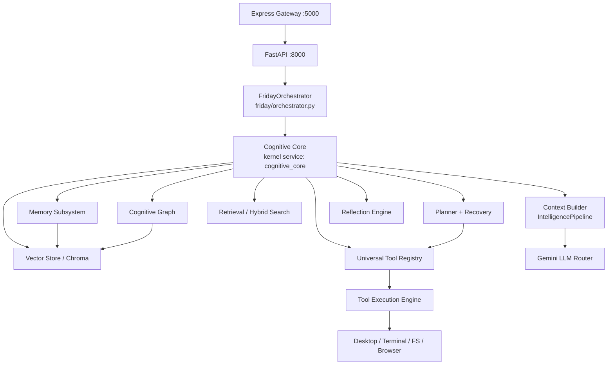
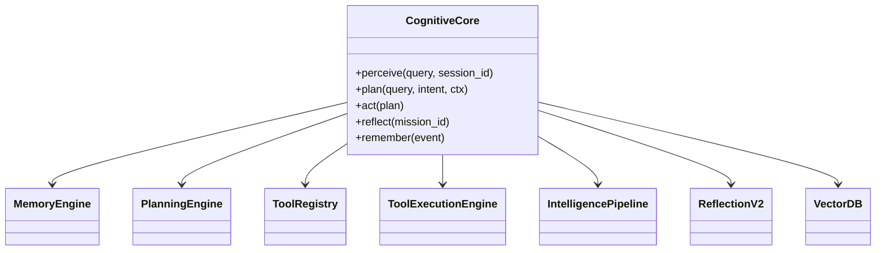

# 1. Cognitive Core — Master Architecture

## 1.1 Position in the system

The Cognitive Core sits **between** the Conversational Runtime (already complete: gateway → FastAPI → orchestrator → LLM) and the **Action Layer** (tools, missions, desktop automation). It is the persistent "brain": it remembers, reflects, retrieves, plans, and selects tools, then feeds a fully-assembled context to the LLM and routes execution.

## 1.2 Layered design

## 1.3 The `cognitive_core` service

A new facade module `app/cognitive_core/__init__.py` (or `app/cognitive/core.py`) that:

- is registered as a **singleton kernel service** `cognitive_core` (fixes the current gap where `cognitive_engine` is lazily instantiated per-request in `cognitive_inspector.py` and never lifecycle/health managed);
- owns references to `memory_engine`, `universal_tool_registry`, `tool_selection_engine`, `tool_execution_engine`, `planner`/`planning_engine`, `mission_runtime`, `intelligence_pipeline`, `llm_router`, `event_bus`;
- exposes the high-level API used by `FridayOrchestrator`:
  - `perceive(query, session_id)` → retrieves + builds working memory
  - `plan(query, intent, ctx)` → delegates to unified planner (with recovery)
  - `act(plan)` → delegates to tool/mission execution
  - `reflect(mission_id)` → post-hoc learning
  - `remember(event)` → writes memory/episodic/graph
- emits/consumes the existing `FridayEvent` types; no new event vocabulary required.

## 1.4 What is reused vs redesigned (summary)

**Reused as-is:** `MemoryEngine`, `SQLiteStore`, `VectorDB` (Chroma+fallback), `PlanningEngine`/`GoalPlanner`/`ReasoningPipeline`/`ConfidenceEngine`/`RecoveryPolicies`, `ToolRegistry`/`ToolExecutionEngine`/`ToolSelectionEngine`, `IntelligencePipeline` + `StrategyManager`/`ContextRanker`/`AdaptiveTokenBudgetAllocator`/`ContextCompressor`/`PromptAssembler`, `ReflectionV2`, `MemoryConsolidator`, `EpisodicMemory`, `KnowledgeGraph`.

**Redesigned / added (thin integration only):**
1. `BaseTool → ToolDefinition` adapter + registry population at boot (fixes GAP-B).
2. Vector-backed `MemoryRetriever` (hybrid keyword+semantic) (fixes GAP-A).
3. Unified `CognitiveGraph` over `memory/graph.py` + `atlas` (fixes two-KG drift).
4. Single embedding client (`EmbeddingProvider`) replacing the two managers.
5. Unified permission model (one `PermissionRegistry`, role-aware).
6. Live-path planner integration + recovery wrapper (fixes GAP-C).
7. Delete dead/duplicate code: `memory/conversation.py`, `capabilities/capability.py:BaseCapability`, unregistered `desktop_input_tools`, `planner/planner.py:record_execution` stub.

See the subsystem files (02–04) and `08-Implementation-Order.md`.
