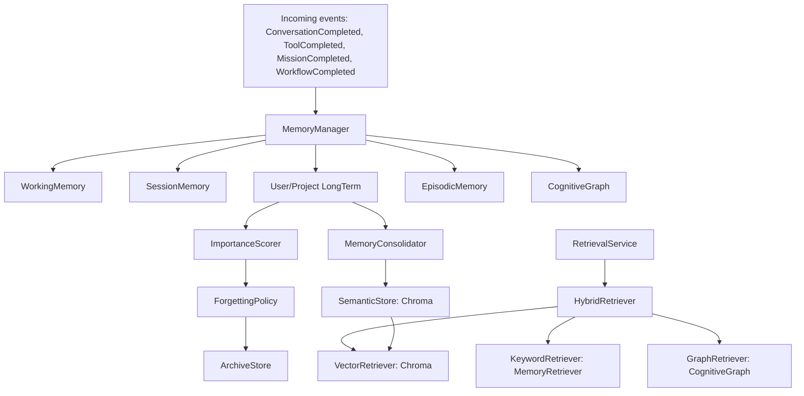
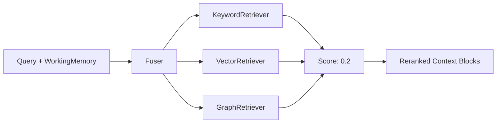
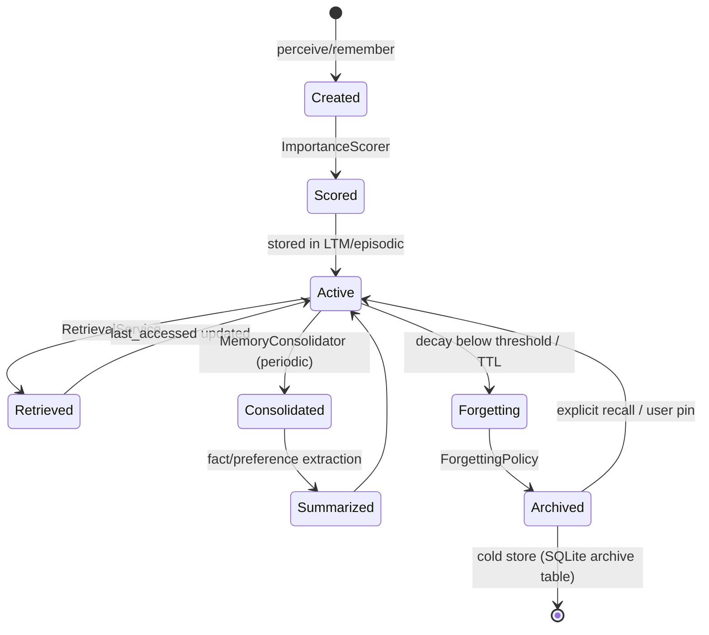

# 2. Memory Architecture

Covers: Persistent Long-Term Memory, Episodic, Semantic, Working, Retrieval, Reflection, Knowledge-Graph integration, Vector Search, and the Memory Lifecycle. Reuses `memory/*`; fixes GAP-A (non-semantic retrieval) and the two-graph drift (GAP-D).

## 2.1 Memory taxonomy (mapped to existing code)

| Type | Existing module | Store key | Status |
|---|---|---|---|
| **Working** | `memory/schema.py:WorkingMemory` (in-memory scratchpad) | runtime only | Reuse; expose per-session |
| **Session/Short-term** | `memory/manager.py:MemoryManager` + `schema.py:SessionMemory` | `session:<id>` | Reuse (this is the already-working short-term store) |
| **Long-Term (User/Project)** | `memory/manager.py` (`get_user_memory`/`get_project_memory`) | `user:<id>`, `project:<id>` | Reuse; add importance + consolidation |
| **Episodic** | `memory/episodic.py:EpisodicMemory` | `episodic:mission:<id>` etc. | Reuse; auto-wire to event bus |
| **Semantic** | `friday/vectordb.py:VectorDB` (Chroma collection `friday_knowledge`) | vector docs | Reuse client; **extend to memory entries** (GAP-A) |
| **Knowledge Graph** | `memory/graph.py:KnowledgeGraph` + `friday/atlas_store.py` | KV `graph:*` + `atlas_graph.db` | **Unify into CognitiveGraph** (GAP-D) |

## 2.2 Component diagram

## 2.3 Persistent Long-Term Memory

- **Store:** existing `SQLiteStore` in `friday_memory.db` (key `user:<id>`, `project:<id>`). No new DB.
- **Schema (logical):** each LTM entry is a `MemoryEntry` (`memory/schema.py`) extended with `importance: float`, `decay: float`, `last_accessed`, `consolidated: bool`, `archive_ref`.
- **Write path:** `MemoryManager.save_user_memory` / `save_project_memory` (reuse) → `ImportanceScorer` computes score → persisted.

## 2.4 Episodic Memory

`memory/episodic.py:EpisodicMemory` already records missions/tools/workflows. **Redesign:** auto-subscribe to `event_bus` topics `MissionCompleted`, `ToolCompleted`, `WorkflowCompleted` (currently only `MemoryManager` subscribes; `EpisodicMemory` is populated manually). Add an `EpisodicRetriever` that returns time-ordered narratives for a goal/mission.

## 2.5 Semantic Memory (fixes GAP-A)

Today embeddings exist (`memory/embeddings.py:EmbeddingsManager`, `friday/knowledge_embeddings.py:EmbeddingProvider`) but are **not used by memory retrieval**. Design:

- Introduce **one** `EmbeddingProvider` (unify the two managers — see §2.10).
- On every LTM/episodic/graph-entity write, compute an embedding and upsert into a **dedicated Chroma collection `friday_memory`** (separate from `friday_knowledge` RAG collection to avoid cross-contamination).
- `SemanticStore` wraps `VectorDB` with `collection="friday_memory"`, `add(ids, embeddings, metadatas, documents)` and `query`.

## 2.6 Working Memory

`WorkingMemory` (schema) is already a model. Design: a per-`session_id` in-memory object owned by `CognitiveCore.perceive()`, holding: active goal, current plan step, retrieved context handles, pending tool results, confirmation tokens. Not persisted (ephemeral), rebuilt each turn from session + retrieval.

## 2.7 Memory Retrieval (Hybrid)

New `RetrievalService` composes three retrievers with weighted fusion:

1. **Keyword/recency** — existing `MemoryRetriever.calculate_score` (recency 0.25 + importance 0.25 + keyword 0.25 + affinity 0.25).
2. **Vector** — `VectorRetriever` over Chroma `friday_memory` collection (cosine).
3. **Graph** — `CognitiveGraph` neighbor traversal (entities/relations mentioned in query).

Weights are configurable and fed into `IntelligencePipeline` as extractor output.

## 2.8 Reflection Engine

Two exist: `cognitive/reflection_v2.py:ReflectionV2` (cognitive-scoped) and `runtime/reflection.py:ReflectionEngine` (mission-scoped). **Redesign:** keep `ReflectionV2` as the canonical engine; have `runtime/reflection` delegate to it. `ReflectionV2.analyze(mission_id, goal_id, execution_data)` produces `ReflectionV2Report` (planner_accuracy, tool_effectiveness, success_strategy, recommendations) and writes learnings into `AdaptiveLearning` + `LearningEngine`. Wire `CognitiveCore.reflect()` to call it after every mission/tool chain.

## 2.9 Knowledge Graph Integration (fixes GAP-D)

Two graphs today: `memory/graph.py:KnowledgeGraph` (KV, call-driven, no embeddings) and `friday/atlas_*` (SQLite snapshot, parser-driven code graph). **Redesign → `CognitiveGraph`:**

- A single graph service backed by the **ATLAS SQLite store** (`atlas_graph.db`) for structural/code entities, plus an in-memory/Redis layer for dynamic runtime entities (people, goals, files touched, tool outcomes).
- Auto-populate runtime entities from events (e.g., `GraphEntityCreated` on tool use, mission creation) — no manual calls.
- Bridge to vector: store node embeddings in the existing (currently unused) `atlas_graph.nodes.embeddings BLOB` column for semantic graph search.
- Expose `GraphRetriever` for the hybrid retriever and reuse `api/atlas.py` read paths.

## 2.10 Vector Search unification

- Single `EmbeddingProvider` interface (`friday/knowledge_embeddings.py` style) used by **both** RAG (`KnowledgeEngine`) and memory (`SemanticStore`). Delete `memory/embeddings.py:EmbeddingsManager` (or make it a thin alias) to remove duplication.
- Two Chroma collections: `friday_knowledge` (documents/RAG) and `friday_memory` (memory entries). Same client (`VectorDB`).

## 2.11 Memory Lifecycle (creation → archival)

- **Creation:** `remember(event)` → classify type → embed → store in LTM/episodic/graph + Chroma.
- **Importance scoring:** `ImportanceScorer` = f(recency, access frequency, explicit user-save, planner confidence, outcome success). Range 0–1.
- **Summarization:** reuse `MemoryConsolidator._consolidate_sessions` / `_extract_facts` / `_detect_preferences`; extend to episodic.
- **Consolidation:** periodic (existing 3600s loop) merges near-duplicate entries, extracts facts/preferences into `consolidated:fact:` / `consolidated:preference:`.
- **Retrieval:** hybrid (§2.7).
- **Forgetting:** `ForgettingPolicy` applies exponential decay; entries with `importance*recency < θ` or past TTL are candidates; user-pinned/goal-linked entries are protected.
- **Archival:** forgotten-but-potentially-useful entries move to an `archive` table (cheap, queryable on explicit request), not deleted, satisfying right-to-be-forgotten while preserving auditability.

## 2.12 Module → file mapping

| New/changed | File |
|---|---|
| `RetrievalService`, `HybridRetriever`, `VectorRetriever`, `GraphRetriever` | `app/cognitive_core/retrieval.py` |
| `SemanticStore` | `app/cognitive_core/semantic_store.py` (wraps `friday/vectordb.py`) |
| `ImportanceScorer` | `app/cognitive_core/importance.py` |
| `ForgettingPolicy`, `ArchiveStore` | `app/cognitive_core/lifecycle.py` |
| `CognitiveGraph` | `app/cognitive_core/graph.py` (wraps `memory/graph.py` + `atlas_store.py`) |
| `EmbeddingProvider` (unified) | `app/llm/embeddings.py` (consolidate `memory/embeddings.py` + `friday/knowledge_embeddings.py`) |
