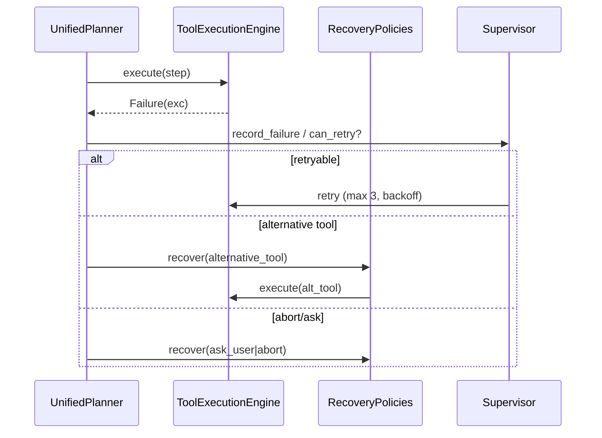

# 4. Planner Architecture (Upgrade)

Fixes **GAP-C**: two parallel planners (live `friday/planner_manager.py` regex vs rich `planner/planning/` + `cognitive/`), and the live `/ask` path has **no failure recovery, monitoring, or reflection**. Reuses `planner/`, `planning/`, `cognitive/`, `runtime/`; adds a **unified Planner interface** and a **recovery wrapper on the live path**.

## 4.1 Current state (audit)

- **Live planner** `friday/planner_manager.py:PlannerManager.create_plan` — linear heuristic: `IntentAnalyzer` → `GoalExtractor` → `CapabilityResolver` → `ClarificationManager` → `TaskClassifier` (regex steps) → `ExecutionPlan` → `PlanValidator`. Tool binding is **regex-based** (filesystem/terminal/open_app/browser/...). No decomposition, no simulation, no recovery.
- **Rich planner** `planner/planning/PlanningEngine` — `decompose_goal` (capability→sub-goals), `generate_plan` (simulate + `HeuristicScorer` + `ConstraintEngine.validate`), `execute_plan` (assigns agents). `planner/goal_planner.py:GoalPlanner`, `planner/reasoning.py:ReasoningPipeline` (7-stage), `planner/confidence.py:ConfidenceEngine`, `planner/recovery.py:RecoveryPolicies`.
- **Cognitive** `cognitive/` — `HierarchicalGoalManager`, `ReflectionV2`, `AdaptiveLearning`, `CollaborativeOrchestrator`.
- **Runtime recovery** `runtime/supervisor.py:Supervisor` (retry via `executor.retry_mission`, max 3), `runtime/monitor.py:ExecutionMonitor`, `runtime/scheduler.py:AdaptiveScheduler`, `runtime/reflection.py:ReflectionEngine`, `runtime/executor.py:MissionExecutor`.

The rich stack is only reached via cognitive missions, **not** `/ask`.

## 4.2 Target: Unified Planner Interface

```mermaid
graph TD
    subgraph Live Path
        Q[/ask or /chat] --> UPI[UnifiedPlanner.plan]
    end
    subgraph Cognitive Path
        CM[cognitive mission] --> UPI
    end
    UPI --> DEC[Decomposer: GoalPlanner.decompose_objective]
    UPI --> SEL[ToolSelector: ToolSelectionEngine + CapabilityResolver]
    UPI --> SIM[Simulator: PlanningEngine.simulate_plan]
    UPI --> CONF[ConfidenceEngine.evaluate_plan]
    UPI --> VAL[ConstraintEngine.validate_plan]
    UPI --> MON[Monitor: ExecutionMonitor]
    UPI --> REC[Recovery: RecoveryPolicies + Supervisor]
    DEC --> SEL --> SIM --> CONF --> VAL --> EXEC[execute_plan via ToolExecutionEngine / MissionExecutor]
    EXEC --> MON --> REC
    REC -->|retry/alt/abort| EXEC
    EXEC --> REFLECT[ReflectionV2.analyze]
```

Define a single facade `UnifiedPlanner` (in `app/cognitive_core/planner.py`) with:

```python
class UnifiedPlanner:
    async def plan(self, query, intent, working_memory) -> UnifiedPlan
    async def execute(self, plan, working_memory) -> ExecutionResult
    async def recover(self, plan, failure, context) -> RecoveryDecision
```

- `plan()` uses **LLM-assisted** decomposition (`ReasoningPipeline` + `GoalPlanner`) for complex intents, falling back to the fast heuristic `PlannerManager` for simple `CHAT`/single-tool intents (latency).
- `execute()` delegates to `ToolExecutionEngine` for tool plans and `MissionExecutor` for multi-step missions.
- `recover()` delegates to `RecoveryPolicies` (retry → alternative_tool → alternative_workflow → ask_user → abort) and `Supervisor`.

## 4.3 Decomposing goals

- Reuse `planner/goal_planner.py:GoalPlanner.decompose_objective` (keyword→capability sub-goals) and `planning/planning.py:PlanningEngine.decompose_goal`.
- Each sub-goal → `Action` (`planning/action.py`) with `dependencies`, `parallel_group`, `fallback_step_id`, `agent_id`.
- For the live path, decomposition depth is capped (e.g., 1–2 levels) to bound latency; deep decomposition is reserved for cognitive missions.

## 4.4 Selecting tools

- Reuse `tool_selection/selector.py:ToolSelectionEngine` (now functional after §3.3 population) + `capabilities/resolver.py:CapabilityResolver`.
- `ReasoningPipeline.ToolSelector` maps capability→tool; `UnifiedPlanner` calls `ToolSelectionEngine.select(context)` to get ranked candidates + `confidence`.
- If confidence < threshold → clarification (`ClarificationManager`) or ask_user recovery.

## 4.5 Planning execution + monitoring

- Execution backend: `ToolExecutionEngine` (tools) and `MissionExecutor` (missions) — both exist.
- Monitoring: `runtime/monitor.py:ExecutionMonitor` records latency/timeout/confidence; `snapshot(mission_id)` returns warnings. `AdaptiveScheduler.reorder` re-prioritizes.
- `PlanningEngine.simulate_plan` + `HeuristicScorer` give pre-execution risk; `ConfidenceEngine.evaluate_plan` gates `should_proceed`.

## 4.6 Recovering from failures (new on live path)

Wrap the live execution in the same recovery the mission runtime already has:



- `RecoveryPolicies` (`planner/recovery.py`) already implements the strategy chain. `Supervisor` (`runtime/supervisor.py`) implements retry/bound. Wire both into `UnifiedPlanner.recover`.
- Post-execution, `ReflectionV2.analyze` writes learnings → `AdaptiveLearning` → improves future `ConfidenceEngine` + `ToolSelectionEngine` scoring (closing the loop).

## 4.7 What to delete / reconcile

- `friday/planner_manager.py` regex tool-binding block → replace with `ToolSelectionEngine` calls (keep `IntentAnalyzer`/`GoalExtractor`/`ClarificationManager` as inputs to `UnifiedPlanner`).
- `planner/planner.py:DynamicPipelinePlanner.record_execution` stub (hardcoded accuracy) → implement or remove.
- Keep two `ConfidenceEngine`s but have `cognitive/confidence_v2.py` be canonical; `planner/confidence.py` delegates.
- Keep two `ReflectionEngine`s but `cognitive/reflection_v2.py` canonical; `runtime/reflection.py` delegates.

## 4.8 Module → file mapping

| New/changed | File |
|---|---|
| `UnifiedPlanner` facade | `app/cognitive_core/planner.py` (new) |
| Wire into `FridayOrchestrator` | `app/friday/orchestrator.py` (modify `process_query`/`process_stream`) |
| Recovery on live path | reuse `planner/recovery.py` + `runtime/supervisor.py` |
| API | `app/api/planner.py` already exists (`/planner/*`); extend with `/planner/plan` (execute) + `/planner/recover` |
