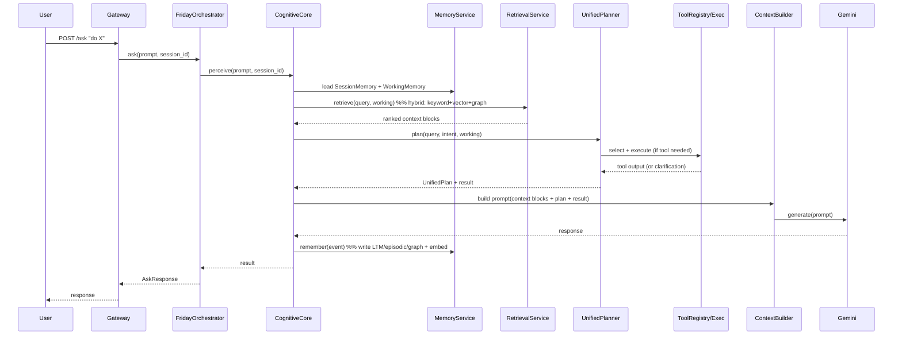
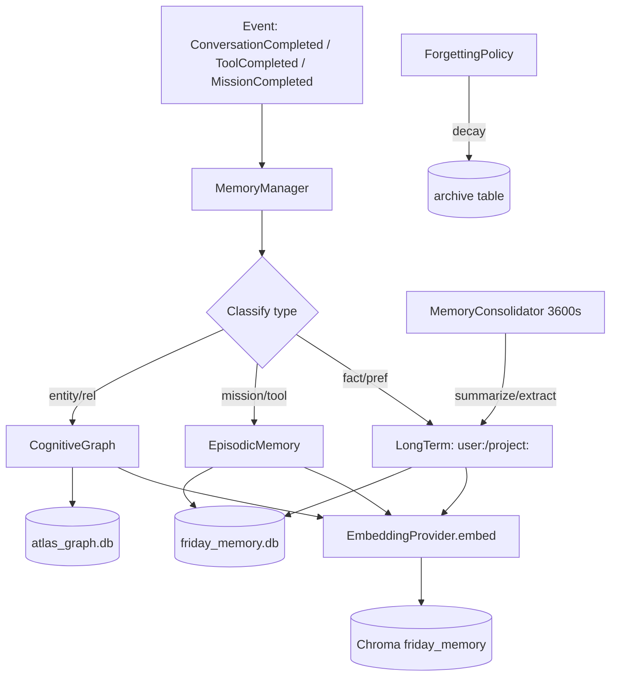
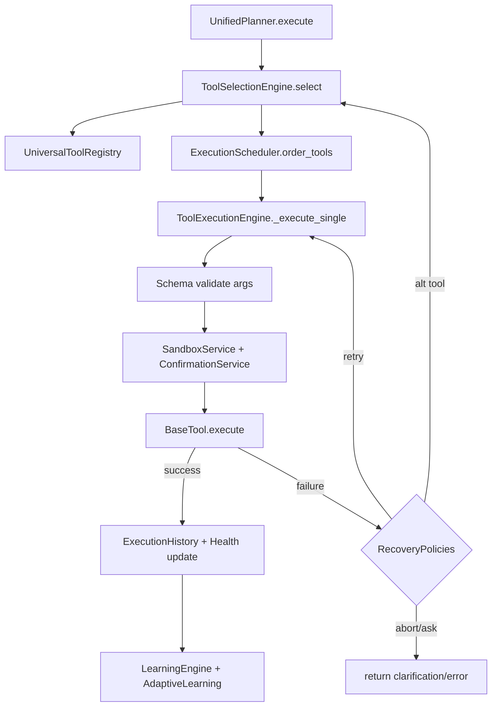
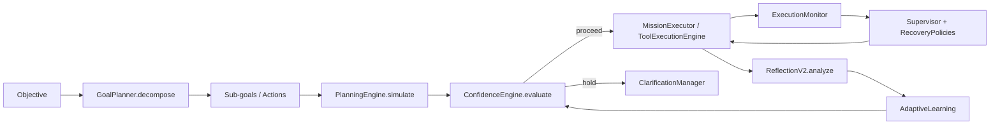
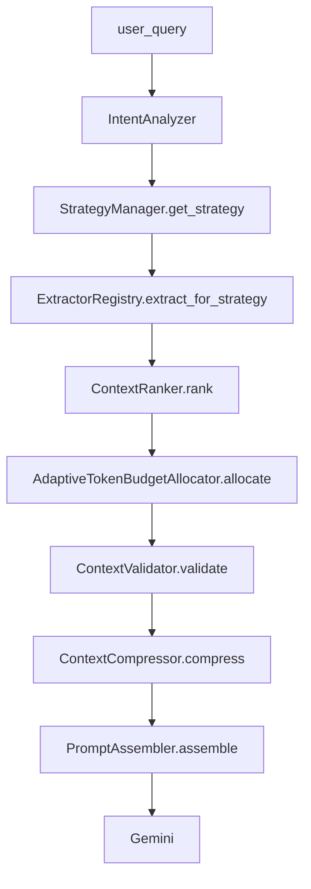

# 5. Data Flow Diagrams

## 5.1 End-to-end: user query → response (with Cognitive Core)

## 5.2 Memory write lifecycle

## 5.3 Tool execution + recovery

## 5.4 Planner decomposition + monitoring

## 5.5 Context assembly (reused IntelligencePipeline)

(Note: `IntelligencePipeline` already implements this 8-stage flow in `intelligence/pipeline.py`; it is wired into `CognitiveCore` as the `ContextService` and fed retrieval results from §5.1.)
