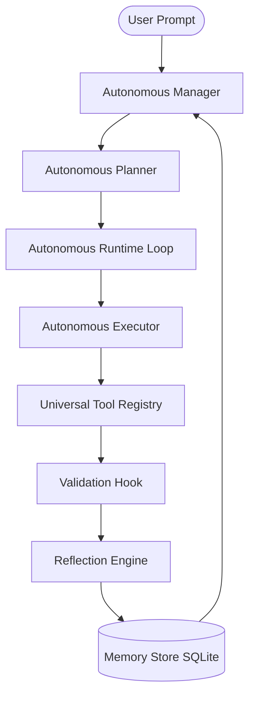

# Semantic Phase 1 Release Notes

These release notes detail the setup, operations, network configurations, and execution commands for the recovered **Autonomous Development System** release candidate.

## Release Metadata
- **Release Version**: `1.0.0-RC1`
- **Canonical Branch**: `semantic-phase1-backup-20260718`
- **Primary Subsystem**: Milestone 7 Autonomous Development System

---

## Core System Architecture

The Autonomous Development System is built around the **O-T-P-E-V-R-P** loop:
1. **Objective (O)**: The user provides a goal prompt.
2. **Tasks (T)**: High-level steps mapped out.
3. **Plan (P)**: The planner creates the execution plan.
4. **Execute (E)**: The executor runs the task using tools.
5. **Validate (V)**: Verify the output matches expectations.
6. **Reflect (R)**: The reflection engine extracts learnings.
7. **Persist (P)**: State is persisted to memory.



---

## Service Networking & Ports

The system relies on the Gateway proxy to dispatch network traffic.

| Service | Port | Description |
|---|---|---|
| **Gateway Proxy** | `5000` | The primary entry point for all clients. Routes REST requests and WebSocket streams. |
| **FastAPI Core** | `8000` | The python backend server containing core logic and kernel services. |
| **Vite Desktop Dev** | `5173` | The frontend user interface dev server. |

---

## CLI Client Usage

The command-line interface client `friday_cli.py` has been fully restored and communicates through the Gateway proxy.

### Initiate Workspace Analysis
To launch a workspace inspection and vector indexing:

```bash
python3 friday_cli.py inspect .
```

#### Output Expectations
The CLI client submits the request to `http://localhost:5000/autonomous/start` with the parameter `prompt="inspect ."`. The response will show the created goal:
```json
{
  "id": "7ac15104-e3c3-4cfa-b839-a9a304e286bb",
  "prompt": "inspect .",
  "status": "active",
  "created_at": "2026-07-19T04:50:00Z"
}
```

---

## Technical Routing Specifications

### Gateway Mappings
To enable successful frontend-backend communication, the Express Gateway proxy maps incoming routes. The following configurations have been registered in the proxy targets array:
- `/autonomous/*` -> `http://localhost:8000/autonomous/*`
- `/api/autonomous/*` -> `http://localhost:8000/api/autonomous/*`

### REST Endpoints (FastAPI Backend)
- **POST** `/autonomous/start`: Instantiates a goal.
- **POST** `/autonomous/stop`: Gracefully halts a running goal loop.
- **GET** `/autonomous/status`: Queries current goal progress.
- **GET** `/autonomous/goals`: Lists all historical goals.
- **GET** `/autonomous/tasks`: Lists tasks associated with a given goal.
- **WS** `/autonomous/events`: WebSocket connection to stream real-time task status changes.
