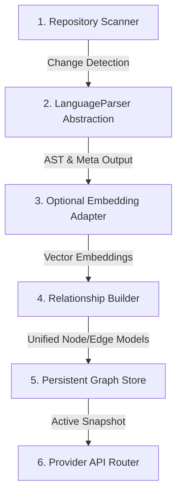

# Implementation Plan - ATLAS v1.1 Live Knowledge Graph (Final Revision)

This revision finalizes the **ATLAS Knowledge Graph Engine** as a production-grade system with modular abstractions, SQLite snapshot versioning, concurrency safety queues, and future-proof embedding adapters.

---

## 1. System Integration & Architecture

We decompose the backend logic into six distinct modular pipeline stages:



### Stage 1: Repository Scanner
- Walks workspace folders to detect changes (based on mtime and SHA-256 hashes).
- Triggers incremental parsing updates for new/modified files, and handles removals for deleted files.

### Stage 2: LanguageParser Abstraction
We define a Python abstract class `LanguageParser` with:
- `parse_file(file_path: str, code: str) -> Dict[str, Any]` returning node and relation details.
- Concrete Implementations:
  - `PythonParser`: Uses the Python `ast` module to analyze decorators, routes, classes, and inheritance.
  - `TypeScriptParser`: Spawns a background Node.js subprocess to run [parse_ts_ast.js](file:///home/warlock/ORION/services/friday-api/app/friday/parse_ts_ast.js) utilizing the **TypeScript Compiler API** (for robust, standard AST parsing).
  - `MarkdownParser`: Extracts YAML frontmatter, markdown page links, and wikilinks `[[Some Page]]`.

### Stage 3: Optional Embedding Adapter
- Reserves a slot for vector embeddings (e.g. mapping node titles or descriptions through Friday's `EmbeddingsManager`).
- Runs as a no-op/pass-through by default, keeping it ready for future semantic upgrades.

### Stage 4: Relationship Builder
- Resolves cross-file references and structures relationships:
  - `dependency`: TypeScript/Python module imports or package JSON targets.
  - `inheritance`: Class extension/subclass bindings.
  - `implementation`: Classes implementing Interfaces.
  - `containment`: Folder-to-file paths and parent-module-to-submodule trees.
  - `workflow`: Flow execution dependency paths.
  - `documentation`: Wikilinks, markdown documentation.
  - `semantic`: Future embedding vector distance links.

### Stage 5: Persistent Graph Store (SQLite Snapshot Versioning)
- Graph data is persisted to a local SQLite database `services/friday-api/.friday_kb/atlas_graph.db` with three tables:
  - `metadata`: `schema_version`, `generated_at`, `workspace_id`, `active_snapshot_id`.
  - `nodes`: `id`, `snapshot_id`, `title`, `description`, `type`, `category`, `tags`, `metadata`, `created_at`, `updated_at`, `importance`, `status`.
  - `edges`: `source`, `target`, `snapshot_id`, `type`, `weight`, `confidence`, `metadata`.
- **Snapshot Versioning**: Every new indexing sweep writes under a new `snapshot_id`. Upon successful run completion, `active_snapshot_id` in `metadata` points to the new run. If an run fails or is cancelled, the previous active snapshot is retained, ensuring zero downtime or partial graph states.

### Stage 6: Provider API Router
- `GET /api/atlas/graph?provider={type}`: Returns the current active snapshot nodes and edges.
- `GET /api/atlas/index/progress`: Server-Sent Events (SSE) stream of active progress coordinates.
- `POST /api/atlas/index/trigger`: Runs index sweeps in the background.
- `GET /api/atlas/health`: Exposes indexing statistics, total node size, active cache status, parser health, and recent error stacks.

---

## 2. Concurrency & Index Lifecycle Management

- **Lifecycle Control**: A task lock prevents multiple indexing jobs from executing concurrently.
- **Queueing**: If a re-index request is triggered while an run is active, a single "PENDING" request is queued and executed immediately after the current run completes.
- **Cancellation**: Supports active job cancellation, immediately releasing system locks.
- **Concurrency**: File walking runs in an `asyncio` event loop. Language parsing is offloaded to a `ProcessPoolExecutor` / `ThreadPoolExecutor` combination to leverage multi-core CPU architectures during AST analysis.

---

## 3. Proposed Changes & File List

### Python Backend
1.  **[NEW] [parse_ts_ast.js](file:///home/warlock/ORION/services/friday-api/app/friday/parse_ts_ast.js)**:
    JavaScript utility script using the **TypeScript Compiler API** to dump TypeScript class, interface, inheritance, and import AST nodes.
2.  **[NEW] [atlas_store.py](file:///home/warlock/ORION/services/friday-api/app/friday/atlas_store.py)**:
    Manages SQLite tables (`metadata`, `nodes`, `edges`), schema creation, version upgrades, and active snapshot pointers.
3.  **[NEW] [atlas_parsers.py](file:///home/warlock/ORION/services/friday-api/app/friday/atlas_parsers.py)**:
    Defines the `LanguageParser` base class and concrete `PythonParser`, `TypeScriptParser`, and `MarkdownParser` classes.
4.  **[NEW] [atlas_indexer.py](file:///home/warlock/ORION/services/friday-api/app/friday/atlas_indexer.py)**:
    Orchestrates the incremental index pipeline walks, concurrency queues, job cancellations, and SSE progress events.
5.  **[NEW] [atlas.py](file:///home/warlock/ORION/services/friday-api/app/api/atlas.py)**:
    Exposes the `/api/atlas/graph`, `/api/atlas/health`, `/api/atlas/index/trigger`, and `/api/atlas/index/progress` endpoints.
6.  **[MODIFY] [__init__.py](file:///home/warlock/ORION/services/friday-api/app/api/__init__.py)**:
    Mounts the `/api/atlas` endpoint group.

### React Desktop Client
7.  **[MODIFY] [knowledgeApi.ts](file:///home/warlock/ORION/apps/desktop/src/services/api/knowledgeApi.ts)**:
    Connects frontend API triggers to `/api/atlas/graph` and SSE progress event listeners.
8.  **[MODIFY] [useKnowledgeStore.ts](file:///home/warlock/ORION/apps/desktop/src/features/knowledge/store/useKnowledgeStore.ts)**:
    Links active providers to retrieve subgraphs from the backend.
9.  **[MODIFY] [KnowledgeGraph.tsx](file:///home/warlock/ORION/apps/desktop/src/features/knowledge/pages/KnowledgeGraph.tsx)**:
    Integrates floating progress bars and re-indexing buttons.
10. **[MODIFY] [InspectorPanel.tsx](file:///home/warlock/ORION/apps/desktop/src/features/knowledge/components/InspectorPanel.tsx)**:
    Shows live metadata properties (imports/exports, inheritance, parameters, workflows status).
11. **[MODIFY] [SearchBar.tsx](file:///home/warlock/ORION/apps/desktop/src/features/knowledge/components/SearchBar.tsx)**:
    Expands fuzzy query matches to search through metadata tags, paths, and attributes.

---

## 4. Verification Plan

### Automated Checks
- Compile codebase:
  ```bash
  npm run build --workspace=desktop
  ```
- Run tests:
  ```bash
  .venv/bin/pytest services/friday-api/tests/test_kernel.py
  ```

### Manual Verification
1. Trigger **RE-INDEX** and observe the live progress progress bar.
2. Verify SQLite tables populate with code structures and relationship lines.
3. Switch tab providers and check that workspace layouts refresh instantly.
