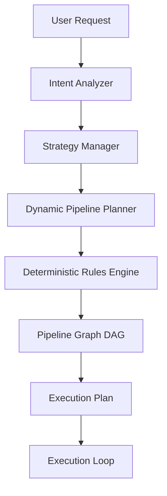

# Friday Dynamic Pipeline Planner Architecture

## 1. System Overview
The Dynamic Pipeline Planner replaces the static sequential execution model of the Friday Intelligence Pipeline with a fully deterministic planning layer. By evaluating query intent, execution strategies, caching states, and active optimizer telemetry, it dynamically customizes the pipeline topology for each user interaction.

## 2. Planning Rules and Heuristics
The planning decision trees remain fully deterministic to prevent runtime behavior variance:
- **Math Queries**: Skip extraction, ranking, validation, and compression. Run assembly directly.
- **Desktop Queries**: Skip standard document extractors; run the `desktop_extractor` exclusively.
- **Mission Queries**: Run full retrieval using mission, workflow, memory, and knowledge extractors.
- **Snapshot Warm-Starts**: Reuse unchanged extractors from previous session snapshot state, executing only invalidated ones.
- **Early Exits**: If cache state confirms all required context blocks exist, skip retrieval, ranking, and validation to finish immediately.

## 3. Pipeline Graph DAG
Stages are structured as a Directed Acyclic Graph (DAG) allowing topological sorting:
- **Parallel Groups**: Extractors can run concurrently.
- **Conditional / Optional Execution**: Steps like compression or validation are pruned dynamically based on telemetry or intent.
- **Transitive Edge Preservation**: Filters subsets of the graph while maintaining strict relative order.

## 4. Telemetry and Estimations
The planner estimates latency and token usage boundaries before launching:
- **Planner Accuracy**: Ratio of actual executed stages vs planned stages.
- **Diagnostics**: Health sweeps query planning latency overhead.
