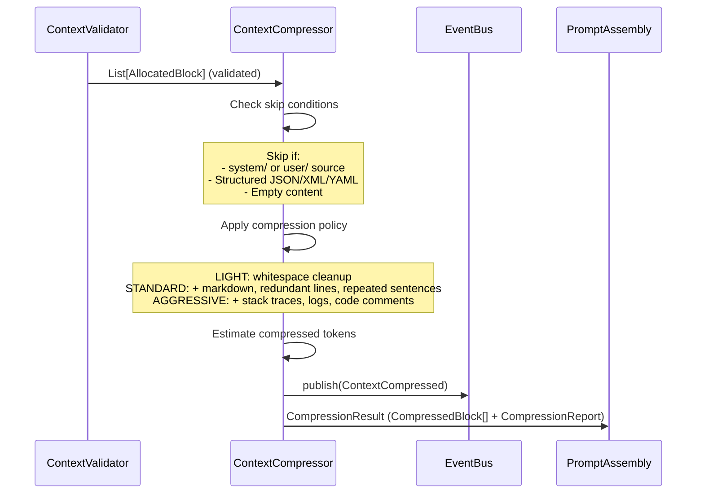

# Context Compressor — Architecture Walkthrough

## Overview

The Context Compressor is responsible for reducing token usage of validated `ContextBlock` objects **after** validation but **before** prompt assembly. It uses four deterministic compression policies (NONE, LIGHT, STANDARD, AGGRESSIVE) that progressively apply more aggressive techniques while never summarizing, hallucinating, or rewriting user intent.

## Data Flow (Sequence)



## Compression Policy Matrix

| Technique | NONE | LIGHT | STANDARD | AGGRESSIVE |
|-----------|------|-------|----------|------------|
| Whitespace cleanup (trailing, blank lines) | - | ✓ | ✓ | ✓ |
| Markdown cleanup (excessive horizontal rules) | - | - | ✓ | ✓ |
| Redundant consecutive line removal | - | - | ✓ | ✓ |
| Repeated sentence removal | - | - | ✓ | ✓ |
| Stack trace shortening (keep first/last 3) | - | - | - | ✓ |
| Log collapsing (deduplicate with count) | - | - | - | ✓ |
| Code comment removal (#, //, --, /* */) | - | - | - | ✓ |
| Code block blank line removal | - | - | - | ✓ (inside ``` fences) |

## Compression Techniques

### 1. Whitespace Cleanup
- Strips trailing whitespace from each line
- Collapses 3+ consecutive blank lines to 2 (preserves paragraph separation)

### 2. Markdown Cleanup
- Collapses consecutive horizontal rules (`---`, `***`, `___`) to a single rule
- Preserves all other markdown structure

### 3. Redundant Line Removal
- Removes consecutive duplicate lines (same stripped content)
- Preserves first occurrence

### 4. Repeated Sentence Removal
- Splits text by sentence boundaries (`.`, `!`, `?`)
- Tracks lowercase normalized sentences and removes duplicates
- Preserves first occurrence

### 5. Stack Trace Shortening
- Detects Python traceback lines (`File "...", line N, in func`)
- Keeps first 3 and last 3 frames
- Inserts `  ...` as a placeholder for collapsed frames

### 6. Log Collapsing
- Detects lines starting with ISO timestamps (YYYY-MM-DD HH:MM:SS)
- Groups consecutive lines with identical message bodies
- Replaces groups of 2+ with `"first_line  [repeated Nx]"`

### 7. Code Block Trimming
- Inside backtick fences (`` ``` ``): removes comment lines and blank lines
- Outside fences: removes comment lines starting with `#`, `//`, `--`, `/*`, `*/`
- Preserves function signatures, identifiers, filenames, and all code structure

## Never-Compress Rules

Blocks matching any of the following conditions are **skipped** (passed through unchanged):

| Condition | Example |
|-----------|---------|
| Source starts with `system/` | `system/prompt` |
| Source starts with `user/` | `user/query` |
| Empty or whitespace-only content | `""` |
| Content looks like JSON | `{"key": "val"}` |
| Content looks like XML | `<root>...</root>` |
| Content looks like YAML | `key: value` |

## Configuration

### CompressionPolicy Enum

```python
class CompressionPolicy(str, Enum):
    NONE = "none"        # No compression
    LIGHT = "light"      # Whitespace only
    STANDARD = "standard" # Whitespace + markdown + redundancy
    AGGRESSIVE = "aggressive" # All techniques
```

Default policy: `STANDARD`

## Output

### CompressedBlock

| Field | Type | Description |
|-------|------|-------------|
| `block` | `AllocatedBlock` | Source block (content may be modified) |
| `original_tokens` | int | Token count before compression |
| `compressed_tokens` | int | Token count after compression |
| `compression_ratio` | float | `1 - (compressed / original)` |
| `estimated_savings` | int | `original - compressed` |
| `policy_applied` | str | Policy name or `"skipped"` |

### CompressionReport

| Field | Type | Description |
|-------|------|-------------|
| `input_tokens` | int | Total tokens across all input blocks |
| `output_tokens` | int | Total tokens after compression |
| `saved_tokens` | int | `input - output` |
| `compression_ratio` | float | `1 - (output / input)` |
| `per_block_statistics` | `List[Dict]` | Per-block stats (source, tokens, ratio, policy) |
| `skipped_blocks` | int | Count of skipped blocks |
| `warnings` | `List[str]` | Non-fatal issues (e.g., content expansion) |

## Token Estimation

Uses a lightweight deterministic placeholder: `max(1, len(text) // 4)`. No tokenizer APIs are called. The `ContextBlock.estimated_tokens` field is used when available; otherwise the placeholder is computed.

## Key Design Decisions

1. **Deterministic** — same inputs + same policy = same output
2. **No summarization** — content is never rewritten, rephrased, or summarized
3. **No hallucination** — compression is purely mechanical (remove, not rewrite)
4. **No reordering** — block order is preserved
5. **Loss-minimized** — function signatures, identifiers, filenames, URLs, timestamps, and metadata are preserved
6. **Skip on structured data** — JSON, XML, YAML are never compressed to avoid breaking parsers

## Package Structure

```
app/compression/
├── __init__.py          # Public exports
├── base.py              # IContextCompressor, CompressionPolicy, CompressedBlock, CompressionReport, CompressionResult
├── events.py            # ContextCompressed
└── compressor.py        # ContextCompressor (concrete implementation)
```

## Boot Sequence

Added as **Step 3h** in `boot.py`, after the Context Validator (Step 3g), preserving the pipeline order: extraction → ranking → budgeting → validation → compression → assembly.

## Integration Points

- **DI**: Singleton `"context_compressor"` in `FridayServiceContainer`
- **Kernel**: `kernel.get_service("context_compressor")`
- **Module Registry**: Module `"context_compressor"` v1.0.0 (depends on `event_bus`)
- **Capability Registry**: `"ContextCompression"`
- **KernelHealth**: `KernelHealth.context_compressor`
- **EventBus**: Publishes `ContextCompressed`
