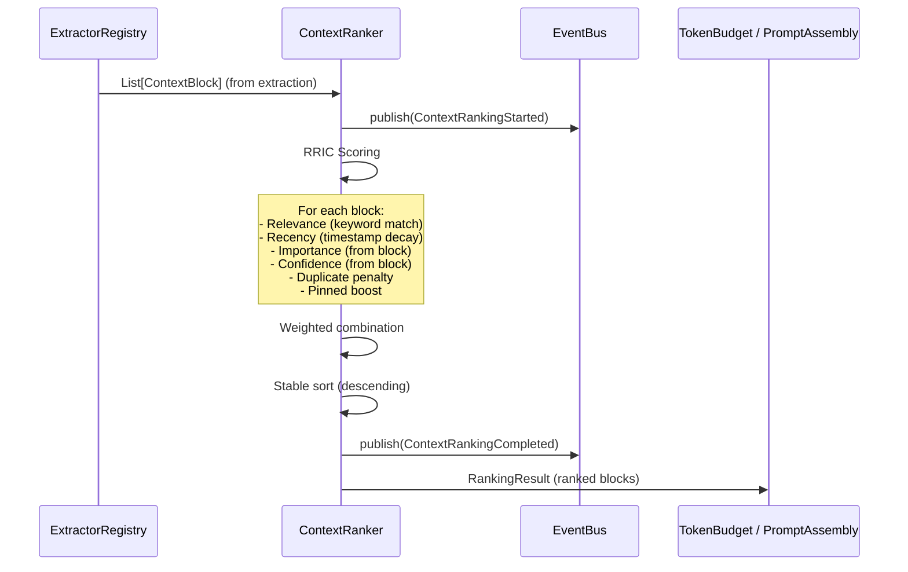

# Context Ranker — Architecture Walkthrough

## Overview

The Context Ranker is a deterministic scoring pipeline that ranks `ContextBlock` objects **after** extraction but **before** token budgeting and prompt assembly. It implements the **RRIC** model (Relevance, Recency, Importance, Confidence) with configurable weights and pluggable scoring factors.

## Data Flow (Sequence)



## Scoring Model

### RRIC Components

| Component     | Source                          | Range     | Default Weight |
|---------------|---------------------------------|-----------|----------------|
| Relevance     | Keyword match (query vs title/content/source) | 0.0–1.0  | 1.0            |
| Recency       | Exponential decay (`ln(2) * age / halflife`) | 0.0–1.0  | 1.0            |
| Importance    | `block.importance`              | 0.0–1.0   | 1.0            |
| Confidence    | `block.confidence`              | 0.0–1.0   | 1.0            |

### Combined Score Formula

```
combined = (R × wR) + (Rc × wRc) + (I × wI) + (C × wC) - dupPenalty + pinnedBoost
```

Where `wR`, `wRc`, `wI`, `wC` are the configurable weights.

### Scoring Factors

#### Relevance
- Tokenizes the query into lowercase alphanumeric tokens (stop words filtered)
- Tokenizes each block's `title`, `content`, and `source`
- Computes `matches / query_token_count`
- If matches > 0, adds `keyword_bonus` (default 0.25), capped at 1.0
- If matches == 0, score is 0.0 (no bonus for zero matches)

#### Recency
- Exponential decay with configurable half-life (default 24 hours)
- `score = exp(-ln(2) * age_hours / halflife_hours)`
- A block with `age == halflife` scores 0.5, `age == 2×halflife` scores 0.25, etc.
- `halflife = 0` disables decay (always returns 1.0)

#### Importance & Confidence
- Directly from the `ContextBlock` fields, clamped to [0.0, 1.0]

#### Duplicate Penalty
- Tracks how many times a `source` string has been seen
- Each subsequent block with the same source gets `penalty * count` subtracted
- Default penalty: 0.15 per duplicate occurrence

#### Pinned Boost
- If `block.metadata["pinned"]` is `True`, adds `pinned_boost` (default 0.5) to the combined score

### Stable Sort
- Python's `sorted()` with key `-combined_score` (stable sort preserves insertion order for equal scores)

## Configuration

```python
@dataclass
class RankingWeights:
    relevance_weight: float = 1.0
    recency_weight: float = 1.0
    importance_weight: float = 1.0
    confidence_weight: float = 1.0
    duplicate_penalty: float = 0.15
    pinned_boost: float = 0.5
    keyword_bonus: float = 0.25
    recency_halflife_hours: float = 24.0
```

## Package Structure

```
app/ranking/
├── __init__.py          # Public exports
├── base.py              # IContextRanker, RankedContextBlock, RankingResult, RankingWeights
├── events.py            # ContextRankingStarted, ContextRankingCompleted
└── ranker.py            # ContextRanker (concrete implementation)
```

## Key Design Decisions

1. **Deterministic** — no ML, no randomness. Same inputs always produce same ranking (modulo floating-point timing in `now()`).
2. **Sync API** — `rank()` is synchronous for speed. Background event publishing uses the EventBus `publish_background()` mechanism.
3. **Non-destructive** — `rank()` does not mutate input `ContextBlock` objects. Scores are stored on `RankedContextBlock` wrappers.
4. **Extensible** — new scoring factors can be added by adding methods to `ContextRanker` and including them in the combined score.
5. **Configurable** — every weight and threshold is exposed via `RankingWeights`; callers can pass custom weights per invocation.
6. **Framework-agnostic** — no dependency on ML frameworks; pure Python math.

## Integration Points

- **Dependency Injection**: Registered as singleton `"context_ranker"` in `FridayServiceContainer`
- **FridayKernel**: Accessible via `kernel.get_service("context_ranker")`
- **FridayModuleRegistry**: Registered as module `"context_ranker"` v1.0.0 (depends on `event_bus`)
- **EventBus**: Publishes `ContextRankingStarted` and `ContextRankingCompleted`
- **Capability Registry**: Capability `"ContextRanking"` registered for subsystem discovery
- **KernelHealth**: `health()` method returns `SubsystemHealth`; integrated into `KernelHealth.context_ranker`

## Boot Sequence

Added as **Step 3e** in `boot.py`, immediately after the Context Extractor Framework (Step 3d), ensuring the ranker is available for all subsequent pipeline stages.
