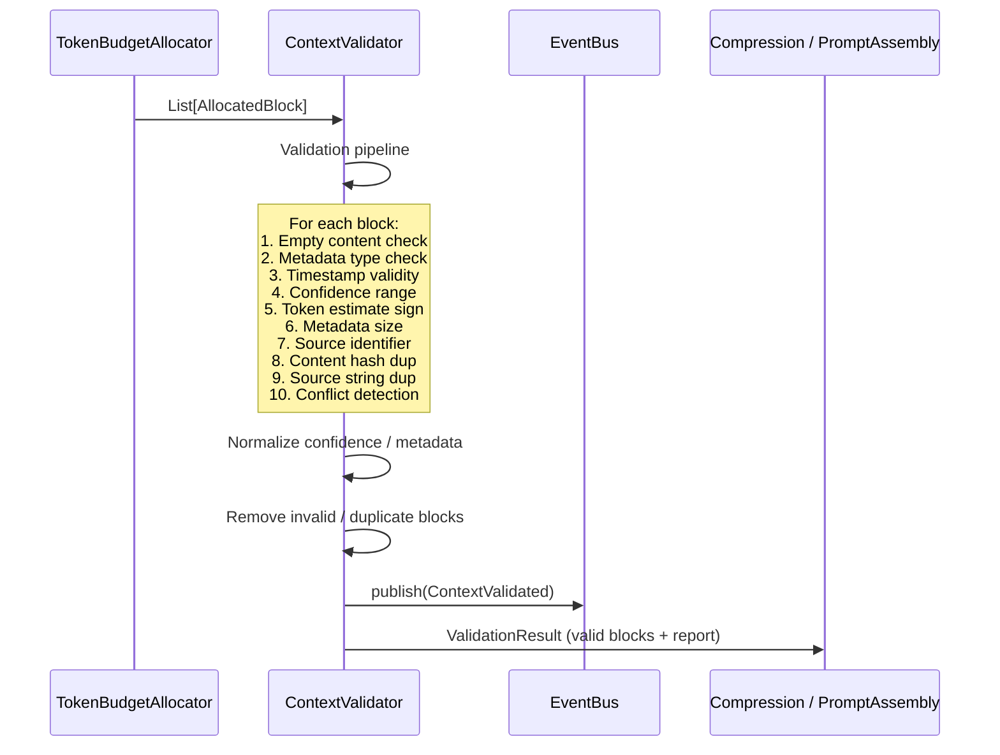

# Context Validator — Architecture Walkthrough

## Overview

The Context Validator is responsible for validating, sanitizing, deduplicating, and filtering `ContextBlock` objects **after** token allocation but **before** compression and prompt assembly. It does not modify user content, compress text, or reorder ranked priorities.

## Data Flow (Sequence)



## Validation Pipeline

### Phase 1: Per-Block Validation Checks

| # | Check | Action | Severity |
|---|-------|--------|----------|
| 1 | Empty / whitespace-only content | Remove block | Error |
| 2 | Metadata is not a `dict` | Remove block | Error |
| 3 | Future timestamp | Remove block | Error |
| 4 | Naive timestamp (no tzinfo) | Warning only | Warning |
| 5 | Timestamp before year 2000 | Warning only | Warning |
| 6 | Confidence outside [0, 1] | Clamp to bounds + Warning | Warning |
| 7 | Negative `estimated_tokens` | Remove block | Error |
| 8 | Metadata size > `max_metadata_size` (5KB) | Warning only | Warning |
| 9 | Empty source or source > 100 chars | Remove block | Error |
| 10 | Unrecognized source prefix | Warning only | Warning |
| 11 | Duplicate content (same MD5 hash) | Remove block (keep 1st) | Duplicate |
| 12 | Duplicate source identifier | Remove block (keep 1st) | Duplicate |

### Phase 2: Conflict Detection

When `enable_conflict_detection = True`, the validator tracks all metadata keys across blocks. If two blocks with the same metadata key have different values, a warning is emitted:

```
Conflicting metadata key 'priority' (was 'high', now 'low')
```

### Phase 3: Normalization

- **Confidence**: Clamped to `[0.0, 1.0]`
- **Metadata**: Non-dict metadata replaced with `{}`
- **Non-destructive**: No content is modified, truncated, or summarized

## Duplicate Detection Algorithm

### Content Duplicates
```python
content_hash = md5(block.content.encode("utf-8")).hexdigest()
if content_hash in seen_content_hashes:
    mark as duplicate
seen_content_hashes.add(content_hash)
```

### Source Duplicates
```python
source_hash = md5(block.source.encode("utf-8")).hexdigest()
if source_hash in seen_source_hashes:
    mark as duplicate
seen_source_hashes.add(source_hash)
```

Both use MD5 for speed; the first occurrence of any duplicate is always kept.

## Configuration

### ValidationConfig

| Field | Default | Description |
|-------|---------|-------------|
| `max_metadata_size` | 5,000 | Max serialized metadata length before warning |
| `max_source_length` | 100 | Max source identifier length |
| `allowed_source_prefixes` | `{memory, knowledge, workflow, desktop, browser, terminal, mission, voice, system, web, project}` | Recognized source prefixes |
| `enable_conflict_detection` | True | Detect conflicting metadata values |
| `enable_duplicate_content_detection` | True | Remove blocks with identical content |
| `enable_content_empty_check` | True | Remove blocks with empty/whitespace content |

## Output: ValidationResult

| Field | Type | Description |
|-------|------|-------------|
| `valid_blocks` | `List[AllocatedBlock]` | Blocks that passed all checks |
| `report` | `ValidationReport` | Summary statistics |

### ValidationReport

| Field | Type | Description |
|-------|------|-------------|
| `input_blocks` | int | Total blocks received |
| `valid_blocks` | int | Blocks that passed validation |
| `removed_duplicates` | int | Blocks removed due to duplicate detection |
| `removed_invalid` | int | Blocks removed due to validation errors |
| `warnings` | `List[str]` | Non-fatal issues found |
| `errors` | `List[str]` | Fatal validation errors |
| `total_removed` | int | `removed_duplicates + removed_invalid` |

## Key Design Decisions

1. **No content modification** — content, title, and source strings are never altered
2. **First-occurrence wins** — for duplicates, the first block is kept and subsequent ones are removed
3. **Deterministic** — same inputs always produce the same validation result
4. **Warning vs Error** — warnings are non-fatal (block kept), errors cause removal
5. **Conflict detection is additive** — metadata differences across blocks generate warnings but don't cause removal
6. **Sync API** — `validate()` is synchronous; event publishing uses background tasks

## Package Structure

```
app/validation/
├── __init__.py          # Public exports
├── base.py              # IContextValidator, ValidationConfig, ValidationReport, ValidationResult
├── events.py            # ContextValidated
└── validator.py         # ContextValidator (concrete implementation)
```

## Boot Sequence

Added as **Step 3g** in `boot.py`, after the Token Budget Allocator (Step 3f), preserving the pipeline order: extraction → ranking → budgeting → validation → compression → assembly.

## Integration Points

- **DI**: Singleton `"context_validator"` in `FridayServiceContainer`
- **Kernel**: `kernel.get_service("context_validator")`
- **Module Registry**: Module `"context_validator"` v1.0.0 (depends on `event_bus`)
- **Capability Registry**: `"ContextValidation"`
- **KernelHealth**: `KernelHealth.context_validator`
- **EventBus**: Publishes `ContextValidated`
