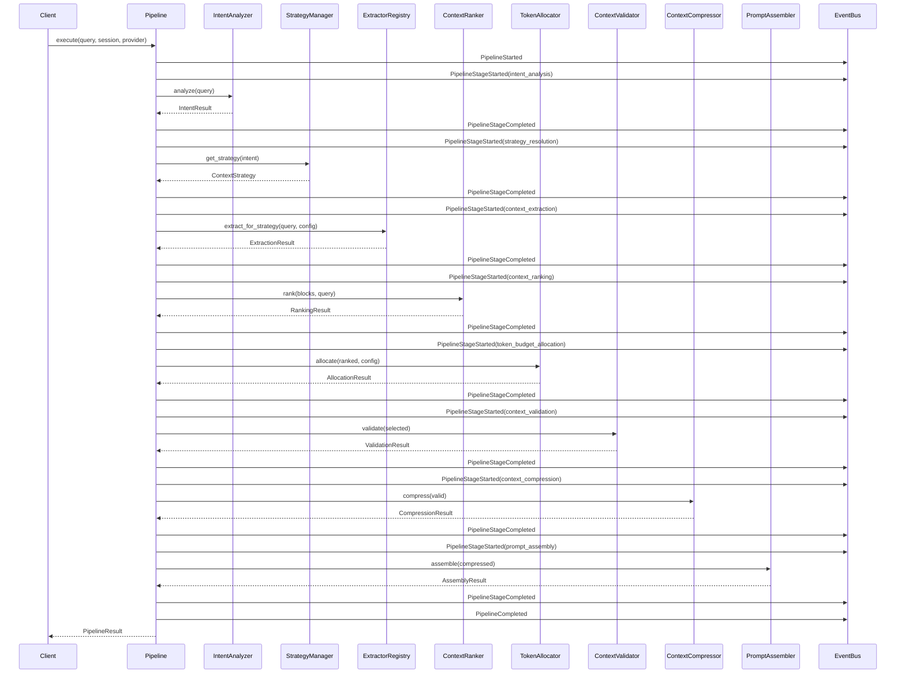
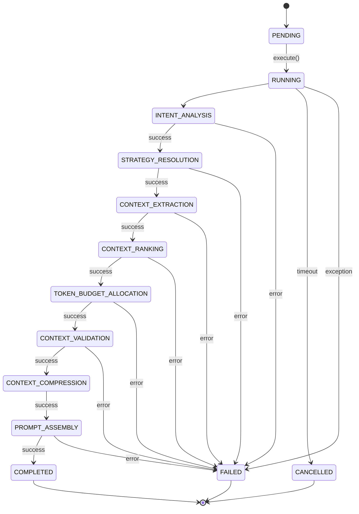
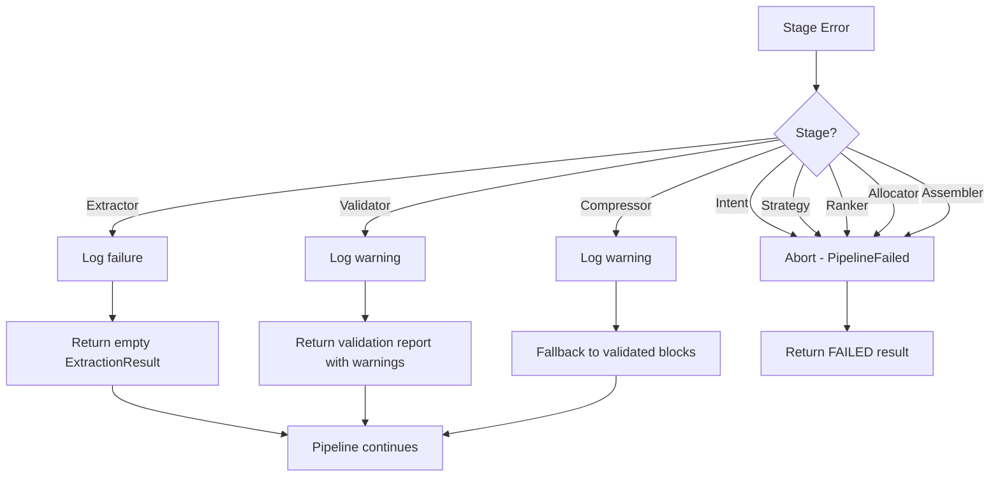

# Intelligence Pipeline Orchestrator — Architecture Walkthrough

## Overview

The Intelligence Pipeline Orchestrator is the **single entry point** for executing the entire context assembly pipeline in FRIDAY. It coordinates 8 subsystems in strict sequence, passing data between them without copying large buffers, collecting per-stage metrics, and publishing lifecycle events.

## Architecture

```
┌─────────────────────────────────────────────────────┐
│                 IntelligencePipeline                 │
│                                                     │
│  execute(user_query, session_id, provider, timeout) │
│                                                     │
│  ┌─────────────┐   ┌──────────────┐   ┌──────────┐ │
│  │  Context     │   │  Metrics     │   │ Events   │ │
│  │  (carries    │   │  (per-stage  │   │ (6 types)│ │
│  │   state)     │   │   latency)   │   │          │ │
│  └─────────────┘   └──────────────┘   └──────────┘ │
└─────────────────────────────────────────────────────┘
         │
         ▼
┌─────────────────────────────────────────────────────┐
│                 8-Stage Pipeline                     │
│                                                     │
│  1. Intent Analyzer     (async analyze)             │
│  2. Strategy Manager    (sync get_strategy)          │
│  3. Extractor Registry  (async extract_for_strategy) │
│  4. Context Ranker      (sync rank)                 │
│  5. Token Allocator     (sync allocate)              │
│  6. Context Validator   (sync validate)              │
│  7. Context Compressor  (sync compress)              │
│  8. Prompt Assembler    (sync assemble)              │
└─────────────────────────────────────────────────────┘
```

## Execution Sequence



## Pipeline State Diagram



## Failure Recovery Diagram



## Data Flow

| Stage | Input | Output | Async? |
|-------|-------|--------|--------|
| Intent Analysis | `str` (user query) | `IntentResult` | Yes |
| Strategy Resolution | `IntentType` | `StrategyConfig` | No |
| Context Extraction | `str` + `StrategyConfig` | `ExtractionResult` | Yes |
| Context Ranking | `List[ContextBlock]` + query | `RankingResult` | No |
| Token Budget Allocation | `List[RankedContextBlock]` | `AllocationResult` | No |
| Context Validation | `List[AllocatedBlock]` | `ValidationResult` | No |
| Context Compression | `List[AllocatedBlock]` | `CompressionResult` | No |
| Prompt Assembly | `List[CompressedBlock]` | `AssemblyResult` | No |

## Data Flow (Token Tracking)


## PipelineMetrics

| Metric | Source | Description |
|--------|--------|-------------|
| `intent_latency_ms` | Timing | Time spent in `IntentAnalyzer.analyze()` |
| `strategy_latency_ms` | Timing | Time spent in `StrategyManager.get_strategy()` |
| `extraction_latency_ms` | Timing | Time spent in `ExtractorRegistry.extract_for_strategy()` |
| `ranking_latency_ms` | Timing | Time spent in `ContextRanker.rank()` |
| `budget_latency_ms` | Timing | Time spent in `TokenAllocator.allocate()` |
| `validation_latency_ms` | Timing | Time spent in `ContextValidator.validate()` |
| `compression_latency_ms` | Timing | Time spent in `ContextCompressor.compress()` |
| `assembly_latency_ms` | Timing | Time spent in `PromptAssembler.assemble()` |
| `raw_tokens` | Count | Token count from extraction |
| `ranked_tokens` | Count | Token count after ranking |
| `validated_tokens` | Count | Token count after validation |
| `compressed_tokens` | Count | Token count after compression |
| `assembled_tokens` | Count | Final prompt token count |
| `warnings` | List | Non-fatal diagnostics |
| `errors` | List | Fatal diagnostics |

## Events

| Event | Trigger | Topic |
|-------|---------|-------|
| `PipelineStarted` | `execute()` called | `PipelineStarted` |
| `PipelineStageStarted` | Each stage begins | `PipelineStageStarted` |
| `PipelineStageCompleted` | Each stage ends | `PipelineStageCompleted` |
| `PipelineCompleted` | All stages succeed | `PipelineCompleted` |
| `PipelineFailed` | Non-recoverable error | `PipelineFailed` |
| `PipelineCancelled` | Timeout or cancellation | `PipelineCancelled` |

## Configuration

| Parameter | Type | Default | Description |
|-----------|------|---------|-------------|
| `user_query` | `str` | — | Raw user input |
| `session_id` | `str` | `""` | Session identifier |
| `provider` | `str` | `"gemini"` | LLM provider |
| `workflow_state` | `Dict` | `None` | Optional workflow context |
| `timeout` | `float` | `120.0` | Total pipeline timeout (seconds) |

## DI Integration

The pipeline resolves services from the kernel's DI container:

```python
kernel = FridayKernel.get_instance()
intent_analyzer = kernel.get_service("intent_analyzer")
```

If no kernel is available, it falls back to direct instantiation:

```python
if intent_analyzer is None:
    intent_analyzer = RuleBasedIntentAnalyzer()
```

## Boot Sequence

Added as **Step 3j** in `boot.py`:

```python
Step 3j: Intelligence Pipeline Orchestrator
  DI:    "pipeline_orchestrator" singleton
  Module: "pipeline_orchestrator" v1.0.0
           depends on: event_bus, intent_analyzer, strategy_manager,
                       extractor_registry, context_ranker, token_allocator,
                       context_validator, context_compressor, prompt_assembler
  Capability: "IntelligencePipeline"
```

The pipeline completes the full Phase 5 integration:

```
User Request → Intent Analysis → Strategy → Extraction → Ranking → Budget → Validation → Compression → Assembly → PromptFrame
     ↑                                             8 subsystems in sequence                                    ↓
     └─────────────────────── IntelligencePipeline.execute() ────────────────────────────────────────────────┘
```

## Package Structure

```
app/intelligence/
├── __init__.py          # Public exports
├── events.py            # Pipeline events (6 types)
└── pipeline.py          # IntelligencePipeline, PipelineMetrics, PipelineResult,
                         # PipelineExecutionContext, PipelineStatus, _CancellationToken
```
