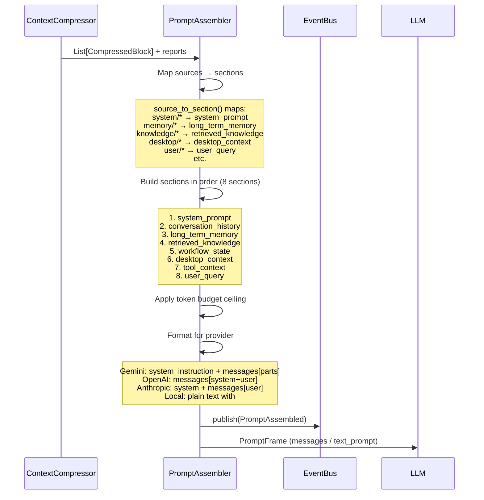

# Prompt Assembler — Architecture Walkthrough

## Overview

The Prompt Assembler is the **final stage** in the context assembly pipeline. It receives compressed `ContextBlock` objects and constructs the final LLM request in provider-specific formats (Gemini, OpenAI, Anthropic, Local), respecting token budgets and section ordering.

## Data Flow (Sequence)



## Source-to-Section Mapping

| Source Prefix | Section |
|--------------|---------|
| `system/` | system_prompt |
| `memory/` | long_term_memory |
| `knowledge/` | retrieved_knowledge |
| `workflow/` | workflow_state |
| `mission/` | workflow_state |
| `desktop/` | desktop_context |
| `browser/` | desktop_context |
| `terminal/` | desktop_context |
| `voice/` | conversation_history |
| `user/` | user_query |
| `project/` | retrieved_knowledge |
| `web/` | retrieved_knowledge |
| *(unknown)* | retrieved_knowledge |

## Provider Comparison Matrix

| Feature | Gemini | OpenAI | Anthropic | Local |
|---------|--------|--------|-----------|-------|
| **Format** | JSON messages | JSON messages | JSON messages | Plain text |
| **System prompt** | `system_instruction` field | `role: "system"` message | `system` field | `### System` header |
| **User messages** | `role: "user"`, `parts: [{text: ""}]` | `role: "user"`, `content` | `role: "user"`, `content` | `### User` header |
| **Assistant role name** | `"model"` | `"assistant"` | `"assistant"` | `"assistant"` |
| **Section context** | Context blocks wrapped as user messages with section labels | Context blocks wrapped as user messages with section labels | Context blocks wrapped as user messages with section labels | Sections labeled with `### Section Name` headers |

## Assembly Pipeline

### Phase 1: Categorization
Each `CompressedBlock` is categorized by its `source` field using `source_to_section()`. Blocks with the same section are grouped.

### Phase 2: Section Building
Sections are built in `SECTION_ORDER`:
```python
SECTION_ORDER = [
    "system_prompt",
    "conversation_history", 
    "long_term_memory",
    "retrieved_knowledge",
    "workflow_state",
    "desktop_context",
    "tool_context",
    "user_query",
]
```

### Phase 3: Token Budget Enforcement
If a `BudgetReport` is provided with `allocated_tokens`, the assembler ensures sections are truncated or omitted to stay within budget. Truncation flags are tracked in the report.

### Phase 4: Provider Formatting
`build_frame()` applies the provider-specific template:
- **Gemini**: `system_instruction` string + `messages` array with `{role, parts[{text}]}`
- **OpenAI**: `messages` array with `{role, content}`, system as first message
- **Anthropic**: `system_instruction` string + `messages` array with `{role, content}`
- **Local**: Plain text with `### Section Name` headers and `\n` separators

## Configuration

### PromptFormat

| Field | Description | Default |
|-------|-------------|---------|
| `provider` | Provider identifier | `"gemini"` |
| `role_system` | Role name for system | `"system"` |
| `role_user` | Role name for user | `"user"` |
| `role_assistant` | Role name for assistant | `"assistant"` |
| `section_separator` | Separator between sections | `"\n\n"` |
| `use_xml_wrappers` | Wrap sections in XML tags | `False` |
| `use_json_messages` | Use JSON message format | `True` |
| `template_name` | Template identifier | `"default"` |

### Predefined Formats

| Constant | Provider |
|----------|----------|
| `GEMINI_FORMAT` | gemini |
| `OPENAI_FORMAT` | openai |
| `ANTHROPIC_FORMAT` | anthropic |
| `LOCAL_FORMAT` | local |

## Output

### PromptFrame

| Field | Type | Description |
|-------|------|-------------|
| `system_instruction` | str | Provider-specific system prompt field |
| `messages` | `List[Dict]` | Chat message array (JSON format) |
| `text_prompt` | str | Plain text prompt (local format) |
| `sections` | `List[PromptSection]` | All 8 sections with content/metadata |

### PromptReport

| Field | Type | Description |
|-------|------|-------------|
| `prompt_tokens` | int | Total assembled token count |
| `section_sizes` | `Dict[str, int]` | Per-section token count |
| `omitted_sections` | `List[str]` | Sections that were omitted |
| `truncation_flags` | `Dict[str, bool]` | Sections that were truncated |
| `provider` | str | Provider identifier |
| `template_name` | str | Template name |

## Key Design Decisions

1. **Deterministic** — same blocks + same budget + same provider = same prompt
2. **No reordering** — section order is fixed; block order within section is preserved
3. **No content modification** — block content is never summarized or rewritten
4. **Budget-aware** — sections are dropped if they exceed the allocated budget
5. **Provider-agnostic core** — assembly logic is shared; formatting is provider-specific
6. **Extensible** — new providers can be added by defining a new `PromptFormat` and updating `build_frame()`

## Package Structure

```
app/assembly/
├── __init__.py          # Public exports
├── base.py              # IContextAssembler, PromptSection, PromptFormat, PromptFrame, PromptReport, AssemblyResult, SECTION_ORDER, SOURCE_TO_SECTION, PROVIDER_FORMATS
├── events.py            # PromptAssembled
├── templates.py         # build_frame() — provider-specific formatting
└── assembler.py         # PromptAssembler (concrete implementation)
```

## Boot Sequence

Added as **Step 3i** in `boot.py`, after the Context Compressor (Step 3h), completing the full pipeline:

```
Intent Analysis → Strategy Selection → Extraction → Ranking → Budgeting → Validation → Compression → Assembly
     Step 3b           Step 3c           Step 3d      Step 3e     Step 3f      Step 3g       Step 3h     Step 3i
```

## Integration Points

- **DI**: Singleton `"prompt_assembler"` in `FridayServiceContainer`
- **Kernel**: `kernel.get_service("prompt_assembler")`
- **Module Registry**: Module `"prompt_assembler"` v1.0.0 (depends on `event_bus`)
- **Capability Registry**: `"PromptAssembly"`
- **KernelHealth**: `KernelHealth.prompt_assembler`
- **EventBus**: Publishes `PromptAssembled`
