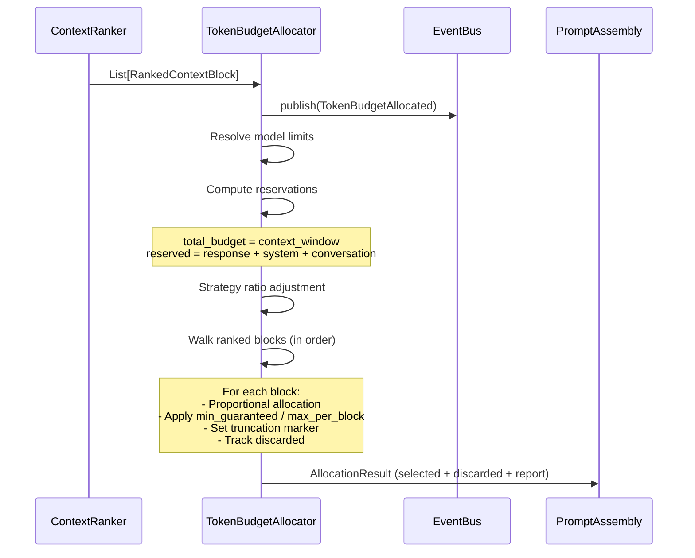

# Token Budget Allocator — Architecture Walkthrough

## Overview

The Token Budget Allocator is responsible for distributing the available LLM context window across ranked `ContextBlock` objects **after** ranking but **before** prompt assembly. It implements adaptive proportional allocation with per-model limits, strategy-aware budgeting, and overflow handling — all without truncating content (it only marks blocks for future truncation).

## Data Flow (Sequence)



## Allocation Algorithm

### Step 1: Resolve Budget

```
total_budget  = model.context_window
reserved      = reserved_response_tokens
              + system_prompt_reservation
              + conversation_history_reservation
available     = total_budget - reserved
```

### Step 2: Strategy Ratio

```
strategy_budget = int(available * strategy_ratio)
```

Where `strategy_ratio` is derived from `StrategyConfig.token_budget`:

```
ratio = (working_memory + retrieved_context + instructions
         + conversation_history + system) / total
ratio = max(0.1, min(ratio, 1.0))
```

If no strategy is provided, ratio defaults to 1.0.

### Step 3: Per-Block Allocation

For each ranked block (in rank order):

1. **Minimum guarantee**: `max(min_guaranteed_per_block, proportional_share)`
2. **Proportional allocation**: `remaining * (token_estimate / total_budget)`
3. **Hard ceiling**: `min(allocated, max_per_block)`
4. **Remaining check**: if `remaining < min_guaranteed`, discard the block
5. **Truncation marker**: if `allocated_tokens < estimated_tokens`, set `is_truncated = True`

### Step 4: Overflow Handling

- If a block's minimum guarantee exceeds remaining budget, it is discarded.
- Lower-ranked blocks are discarded first (the allocator walks in rank order).
- All discarded blocks are collected in `AllocationResult.discarded_blocks`.

## Configuration

### BudgetConfig

| Field | Default | Description |
|-------|---------|-------------|
| `model_name` | `"gemini-1.5-pro"` | Target model identifier |
| `context_window` | 128,000 | Total available tokens for model |
| `reserved_response_tokens` | 4,096 | Tokens reserved for model response |
| `system_prompt_reservation` | 2,048 | Tokens reserved for system prompt |
| `conversation_history_reservation` | 4,096 | Tokens reserved for conversation history |
| `min_guaranteed_per_block` | 128 | Minimum tokens any selected block receives |
| `max_per_block` | 16,384 | Maximum tokens a single block can receive |

### Model Limits (MODEL_LIMITS)

| Model | Context Window | Max Output |
|-------|---------------|------------|
| gemini-2.0-flash | 1,048,576 | 8,192 |
| gemini-1.5-pro | 1,048,576 | 8,192 |
| gemini-1.5-flash | 1,048,576 | 8,192 |
| gpt-4o | 128,000 | 16,384 |
| gpt-4-turbo | 128,000 | 4,096 |
| gpt-4 | 32,768 | 4,096 |
| gpt-3.5-turbo | 16,384 | 4,096 |
| claude-3-opus | 200,000 | 4,096 |
| claude-3-sonnet | 200,000 | 4,096 |
| claude-3-haiku | 200,000 | 4,096 |

Use `BudgetConfig.for_model("gpt-4")` for automatic resolution.

## Key Design Decisions

1. **No tokenizer calls** — uses `block.estimated_tokens` from the extraction layer (already computed).
2. **No content truncation** — blocks are only marked with `is_truncated` metadata; truncation is deferred to prompt assembly.
3. **Deterministic** — same inputs always produce the same allocation.
4. **Strategy-aware** — `StrategyConfig.token_budget` influences the allocation ratio.
5. **Sync API** — `allocate()` is synchronous. Event publishing uses background tasks.
6. **Model catalog** — `MODEL_LIMITS` is extensible; unknown models fall back to defaults.

## Output: AllocationResult

| Field | Type | Description |
|-------|------|-------------|
| `selected_blocks` | `List[AllocatedBlock]` | Blocks selected for prompt, with allocated token counts |
| `discarded_blocks` | `List[RankedContextBlock]` | Blocks that exceeded budget |
| `report` | `BudgetReport` | Full budget utilization report |

### BudgetReport

| Field | Type | Description |
|-------|------|-------------|
| `total_budget` | int | Model context window |
| `reserved_tokens` | int | Sum of all reservations |
| `allocated_tokens` | int | Sum of allocated tokens across selected blocks |
| `discarded_tokens` | int | Sum of estimated tokens from discarded blocks |
| `utilization_percentage` | float | (allocated / strategy_budget) × 100 |
| `selected_blocks` | int | Count of selected blocks |
| `discarded_blocks` | int | Count of discarded blocks |
| `total_blocks_input` | int | Input block count |
| `details` | dict | Model name, strategy budget, remaining, ratio |

## Package Structure

```
app/budget/
├── __init__.py          # Public exports
├── base.py              # ITokenBudgetAllocator, BudgetConfig, BudgetReport, AllocatedBlock, AllocationResult, MODEL_LIMITS
├── events.py            # TokenBudgetAllocated
└── allocator.py         # AdaptiveTokenBudgetAllocator
```

## Boot Sequence

Added as **Step 3f** in `boot.py`, immediately after the Context Ranker (Step 3e), preserving the pipeline order: extraction → ranking → budgeting → assembly.

## Integration Points

- **DI**: Singleton `"token_allocator"` in `FridayServiceContainer`
- **Kernel**: `kernel.get_service("token_allocator")`
- **Module Registry**: Module `"token_allocator"` v1.0.0 (depends on `event_bus`)
- **Capability Registry**: `"TokenBudgetAllocation"`
- **KernelHealth**: `KernelHealth.token_allocator`
- **EventBus**: Publishes `TokenBudgetAllocated`
