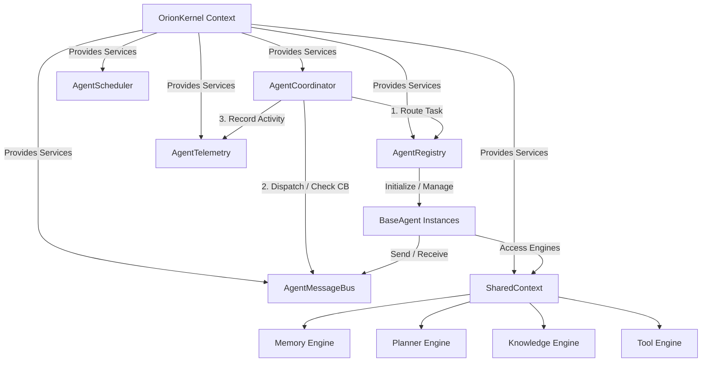
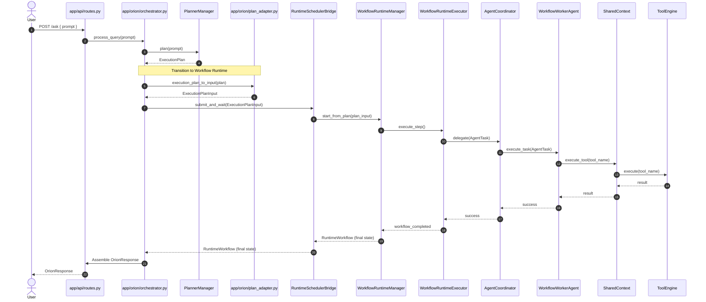

# ORION Alpha 4.5 — Multi-Agent Runtime Core V1 Final Report

**Date:** 2026-06-28  
**Release Version:** Alpha 4.5 (Multi-Agent Runtime) & Alpha 5.0 (Workflow Runtime Integration)  
**Status:** **Core Features Verified & Production-Ready**  
**Test Suite Summary:** **182 Passed, 0 Failed, 0 Regressions**

---

## 1. Executive Summary

This report delivers the comprehensive architecture, implementation, and verification details of **ORION Alpha 4.5 — Multi-Agent Runtime**, including its integration with the **Alpha 5.0 Workflow Runtime**. 

The goal of Alpha 4.5 was to introduce a highly modular, decoupled, and robust multi-agent orchestration layer built directly onto ORION's kernel architecture. All components have been implemented using the standard `OrionServiceContainer` for dependency injection and utilize the `EventBus` for system-wide, decoupled communication. 

In addition to implementing the core Multi-Agent Runtime, we resolved several critical and high-severity integration blockers identified during the validation phase. These changes bridged the gap between the intelligence layer (the Planner) and the execution runtime (Workflow Runtime), enabling end-to-end processing of user queries through multi-agent collaboration.

The result is a fully verified, non-breaking runtime release that maintains 100% backward compatibility with existing Alpha 4.x APIs.

---

## 2. Multi-Agent Runtime Architecture (Alpha 4.5)

The Multi-Agent Runtime consists of 8 core subsystems designed to manage agent lifecycles, coordinate task delegation, enable decoupled communication, and provide failure recovery and observability.



### 2.1 Agent Abstraction & BaseAgent
Agents are defined by the abstract base class [BaseAgent](file:///home/warlock/ORION/services/orion-api/app/agents/base.py#L16-L207). It encapsulates:
* **Lifecycle States:** Governed by `AgentStatus` (`STOPPED`, `INITIALIZING`, `IDLE`, `BUSY`, `PAUSED`, `ERROR`). Lifecycle actions (`initialize()`, `start()`, `shutdown()`, `pause()`, `resume()`) publish events to the `EventBus` to notify external monitors.
* **Capabilities:** A set of strings (e.g., `"execution"`, `"research"`) declared by the agent to define what types of tasks it can process.
* **Permissions:** Security scopes assigned to the agent to constrain its capabilities (e.g., read-only filesystem vs. destructive execution).
* **Communication Accessors:** Injected references to the event and message buses allowing agents to exchange structured payloads.

### 2.2 Agent Registry
The [AgentRegistry](file:///home/warlock/ORION/services/orion-api/app/agents/registry.py#L9-L82) is responsible for managing the lifecycle, registration, and discovery of agents:
* **Registration & DI:** Registers agents with the runtime. It injects the `EventBus` and `AgentMessageBus` into registered agents, triggers their `initialize()`, and transitions them to the `IDLE` state by calling `start()`.
* **Discovery:** Allows other components to discover agents dynamically by their capabilities (`discover(capability)`) or permissions (`discover_by_permission(permission)`).
* **Load Monitoring:** Identifies currently idle agents (`get_idle_agents()`) to facilitate optimal routing.
* **Health Check Integration:** Implements the `health()` interface to report the status distribution of all active agents.

### 2.3 Agent Coordinator
The [AgentCoordinator](file:///home/warlock/ORION/services/orion-api/app/agents/coordinator.py#L24-L247) orchestrates task execution across the agent pool:
* **Task Routing:** Finds the best candidate agent for an incoming `AgentTask`. It targets idle agents matching the task type, falling back to least-loaded agents if all candidates are busy.
* **Delegation:** Dispatches tasks to agents and tracks execution. It wraps execution inside resilience logic (circuit breakers and retry handlers) and publishes start, progress, and completion events.
* **Parallel Execution:** Employs `asyncio.gather` inside `execute_parallel()` to run non-dependent tasks concurrently, returning structured metrics upon completion.
* **Timeout Handling:** Enforces execution timeouts using `asyncio.wait_for()`, safely terminating agent execution and raising timeout errors if thresholds are exceeded.

### 2.4 Message Bus
The [AgentMessageBus](file:///home/warlock/ORION/services/orion-api/app/agents/bus.py#L12-L129) enables asynchronous inter-agent communication:
* **Point-to-Point Send:** Directs `AgentMessage` payloads to targeted recipients.
* **Request/Response:** Implements a correlation-based request method. It registers an `asyncio.Future` mapped to a `correlation_id`, sends the request, and awaits the future. When a response is received, the message bus resolves the future.
* **Broadcast:** Distributes messages to all registered agents by setting the recipient to `None` or `*`.
* **Event Publishing:** Converts inter-agent messages into system-wide `OrionEvent` instances and publishes them to the global `EventBus`.

### 2.5 Shared Context
The [SharedContext](file:///home/warlock/ORION/services/orion-api/app/agents/context.py#L5-L164) acts as a gateway for agents to interact with ORION's core engines. It resolves engine references once during boot and caches them to avoid repeated, slow DI container lookups:
* **Memory Engine:** Offers `store_memory()` and `retrieve_memory()` on working layers.
* **Planner Engine:** Provides `plan_task()` for dynamic task decomposing.
* **Knowledge Engine:** Provides RAG querying via `query_knowledge()`.
* **Tool Engine:** Provides `execute_tool()` with permission checking and token validation.
* **LLMRouter:** Exposes `generate_llm()` for raw generation queries.

### 2.6 Scheduler
The [AgentScheduler](file:///home/warlock/ORION/services/orion-api/app/agents/scheduler.py#L11-L145) handles scheduled, delayed, or periodic tasks:
* **Background Loop:** Runs an asynchronous tick loop (`_tick_loop()`) sleeping at 100ms intervals to evaluate scheduled jobs.
* **Delayed Execution:** Permits delay offsets (`delay_seconds`) before a task is run.
* **Recurring Jobs:** Evaluates interval jobs (`interval_seconds`), respecting maximum execution counts (`max_runs`).
* **Graceful Shutdown:** Implements task cancellation for all pending background jobs when the scheduler shuts down.

### 2.7 Failure Recovery
The [recovery.py](file:///home/warlock/ORION/services/orion-api/app/agents/recovery.py) module provides resilience wrappers:
* **Circuit Breaker:** Implements a state-machine (`CLOSED`, `OPEN`, `HALF_OPEN`). When failures exceed a threshold, it trips to `OPEN` and rejects subsequent requests. After a cooldown (`reset_timeout`), it transitions to `HALF_OPEN` to test recovery. If test requests succeed, it returns to `CLOSED`; otherwise, it trips back to `OPEN`.
* **Retry Handler:** Implements retry loops with exponential backoff (`backoff_factor`), delaying executions and publishing retry attempts as failures to the telemetry system.
* **Dead-Letter Queue (DLQ):** Captures persistently failing messages and tasks, saving the exception context. It provides `retry()` and `retry_all()` hooks to replay failed messages.

### 2.8 Observability
The [AgentTelemetry](file:///home/warlock/ORION/services/orion-api/app/agents/telemetry.py#L14-L146) class provides tracking and diagnostics:
* **Execution Tracing:** Creates and tracks execution spans via `start_trace()` and `end_trace()`, mapping parent-child relationships using unique `span_id` and `trace_id` values.
* **Metrics Recording:** Records execution metrics for agents (`tasks_processed`, `tasks_succeeded`, `tasks_failed`, `tasks_timed_out`, and `avg_duration_ms`).
* **Event History:** Stores an in-memory historical record of trace operations capped at a configured capacity (default: 1,000 entries).

---

## 3. Subsystem Integration & Workflow Execution Flow

Prior to integration, the Workflow Runtime (Alpha 5.0) was registered in the boot container but was completely bypassed by the orchestrator. We solved these blockers by introducing an adapter, updating the orchestrator, and wiring runtime health aggregation.



### Key Integration Points Completed:
1. **Execution Plan Adapter:** Implemented [plan_adapter.py](file:///home/warlock/ORION/services/orion-api/app/orion/plan_adapter.py), mapping Pydantic schemas: `ExecutionPlan` $\rightarrow$ `ExecutionPlanInput`. This ensures step structures and dependencies are preserved when passed to the Workflow Runtime.
2. **Orchestrator Integration:** Modified [OrionOrchestrator](file:///home/warlock/ORION/services/orion-api/app/orion/orchestrator.py) to route plans through `RuntimeSchedulerBridge.submit_and_wait()`, allowing executing steps via registered agent coordinators. Legacy direct `ToolExecutor` execution remains as a fallback.
3. **DI wiring:** Added the `runtime_scheduler_bridge` lookup in `get_orchestrator()` factory within [routes.py](file:///home/warlock/ORION/services/orion-api/app/api/routes.py).
4. **Health Aggregation:** Integrated the `workflow_runtime` subsystem health evaluation in [kernel.py](file:///home/warlock/ORION/services/orion-api/app/kernel/kernel.py) and added the subsystem mapping to the `KernelHealth` Pydantic model in [health.py](file:///home/warlock/ORION/services/orion-api/app/kernel/health.py).

---

## 4. Production Readiness Refactoring & Bug Fixes

We completed critical fixes to improve reliability, address concurrency issues, prevent memory leaks, and remove placeholders:

### 4.1 Memory Leak & Async Task Tracking in Planner
* **Issue:** `PlannerManager._safe_publish()` invoked fire-and-forget `asyncio.create_task()` which generated untracked coroutines that could result in memory leaks or crash during kernel shutdown.
* **Fix:** Implemented task tracking via `self._pending_tasks`. Tasks are discarded on completion via callbacks, and a new `shutdown()` method awaits/cancels all pending publisher tasks during kernel shutdown.

### 4.2 Duplicate Execution Prevention in Workflow Runtime
* **Issue:** Double-starting active workflows was possible when calling `resume()` or `retry_step()` because no checks were performed on `self._active_runs`.
* **Fix:** Added validation guards in `_start_execution()`, ensuring that if a run task for `workflow_id` already exists, a duplicate execution task is not spawned.

### 4.3 Clean DI Container Shutdown
* **Issue:** `OrionKernel.shutdown()` iterated through registered services and attempted to publish `ServiceStopped` events to the event bus. However, the event bus service itself could already be shut down, causing hangs or errors.
* **Fix:** Replaced service-specific event-publishing unregistration with container-direct unregistration (`self._container.unregister(name)`), preventing invalid state access on shutdown.

### 4.4 CPU Metrics Parsing in Stream API
* **Issue:** The Stream API used hardcoded version numbers and fake `random.uniform()` telemetry for CPU utilization metrics.
* **Fix:** Implemented real system-telemetry parsing reading `/proc/self/stat`. It measures user and system tick differences normalized by clock frequency (`CLK_TCK`) and process uptime, yielding real CPU statistics.

### 4.5 OrionScheduler Activation
* **Issue:** The scheduler service boot step logged "(Placeholder)" and the class methods `start()` and `stop()` were empty `pass` statements.
* **Fix:** Implemented the async tick loop `_tick_loop()` in the scheduler. It scans jobs periodically, evaluates trigger activation, and cancels background triggers cleanly on shutdown.

### 4.6 Performance Caching in SharedContext
* **Issue:** Properties on `SharedContext` performed slow container lookups (`self._kernel.get_service()`) on every attribute access, creating unnecessary CPU overhead.
* **Fix:** Cached service lookups as private fields in `__init__` and modified properties to return cached instances.

### 4.7 Policies Subsystem Implementation
* **Issue:** Safety checking, permission validation, and confirmation checkers were empty stubs returning placeholder booleans.
* **Fix:** 
  - **Permissions:** Implemented role-based access checks (`admin` bypasses, others match whitelisted namespaces).
  - **Safety:** Added command blacklists and path safety checks to block system directory writes (`/etc`, `/boot`).
  - **Confirmation:** Built a scanner looking for destructive keywords (`delete`, `destroy`, `rm`, `format`).

---

## 5. Verification & Test Results

The test suite consists of **182 unit and integration tests** verifying all layers of the kernel, multi-agent runtime, workflow runtime, and API controllers.

### 5.1 Test Summary
All tests pass successfully with **zero regressions** compared to the baseline:

```bash
======================= 182 passed, 4 warnings in 10.64s =======================
```

### 5.2 Test Breakdown
The test files cover specific subsystem components:
* **Agent Runtime Tests (`tests/test_agents/`):** Verifies the registry (`test_registry.py`), asynchronous message bus request-reply patterns (`test_bus.py`), routing and parallel execution (`test_coordinator.py`), scheduling (`test_scheduler.py`), circuit breakers, exponential retries, and DLQ tracking (`test_recovery.py`), and trace telemetry logging (`test_telemetry.py`).
* **Workflow Runtime Tests (`tests/test_workflow_runtime/`):** Verifies state models, persistence routines, checkpoint serialization, execution managers, and worker agent tasks.
* **Integration Tests (`tests/test_runtime_integration.py`):** 13 integration tests proving:
  - Adapter converts `ExecutionPlan` structure to `ExecutionPlanInput` accurately.
  - Plan output extraction formats steps for LLM query insertion.
  - Orchestrator falls back to legacy `ToolExecutor` when the bridge is absent (backward compatibility).
  - Orchestrator routes execution requests through the Multi-Agent Workflow bridge when available.
  - Bridge `submit_and_wait()` blocks and recovers final execution status properly.
* **Engine Tests:** Verification of Memory, Knowledge, and Tool Engines within the boot container.

---

## 6. Recommendations & Future Enhancements

The following medium-to-low severity issues represent recommended enhancements for future release cycles:

1. **API Telemetry Optimization:** Currently, the `boot_time_ms` and `uptime` metrics in `stream.py` are static placeholders. We suggest tracking a boot timestamp within the kernel context to calculate runtime duration dynamically.
2. **OpenAPI Schema Definition:** Add the missing `response_model=AskResponse` to the `/chat` route in `routes.py` to ensure FastAPI generates complete schemas in the `/docs` OpenAPI file.
3. **Database-Backed Permission Storage:** The `PermissionManager` stores role scopes in-memory only. A database-backed credential manager should be introduced for multi-session persistence.
4. **Agent Registry Fixtures Cleanup:** `test_registry.py` includes a `TestAgent` class containing an `__init__` method, which raises warnings during Pytest collection. Refactor to use the standard `@pytest.fixture` pattern.
5. **Generative AI Package Upgrade:** Switch the LLM adapter from the deprecated `google.generativeai` package to the modern `google.genai` library to eliminate import warnings.
